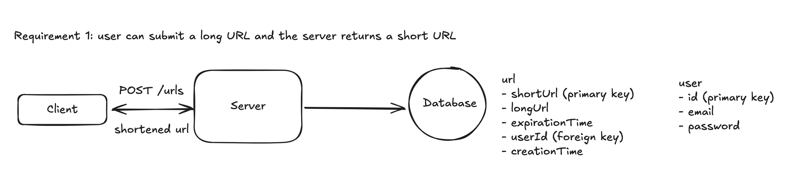
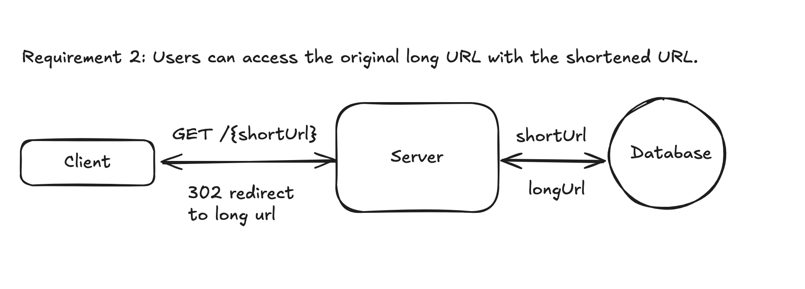

# System design: A URL Shortener

## How to approach this problem, or any system design problem
We could approach a system design problem, with the following steps: 
0. Understand the problem, i.e. what an url shortener is, how it works.
1. Understand the functional requirements and non-functional requirements for this system. Functional requirements specify the specific functions or behaviors a system must perform to meet user needs. On the other hand, non-functional requirements define how a system should perform, focusing on qualities attributes, like performance, security, usability, reliability, and scalability.
2. Identify and define core entities.
3. Design APIs or interfaces.
4. Create a high level design. This design should focus and meet all functional requirements made in Step#1.
5. Dive deeper into the design. This phase should be focused on some, if not all, non-functional requirements made in Step#1.

Let's go through the design process step by step.

## 0. Understand the problem
This problem is quite easy, to design an url shortener that converts a long url into a short one, like bit.ly.

## 1. Define functional and non-functional requirements 
For functional requirements, the core requirements could be:
- Users can input a long URL on the UI page and the shortener generates a shortened URL for the user.
  - Optionally, users can specify an expiration time for the URL. 
- Users can access the original long URL with the shortened URL.

[//]: # (TODO: authentication and account management? google analytics?)

For non-functional requirements, there are different aspects like performance, latency, availability, scalability, reliability, etc. Think about characteristics of the system and identify what's the most important.
For instance, uniqueness is a key consideration, as it determines if users will be redirected to the original URL correctly. Another important quality is low-latency, as when users clicks a shortened URL, they'll need to be redirected to the original ones. We want to make sure it feels like there's no additional round trip.
In addition, when designing a system in real world, we have estimation on its traffic and scale and design decisions are made based on that. For now I'm just making assumption.

To summarize, the core non-functional requirements are:
- The system should ensure uniqueness on shortened URL (as less collision as possible).
- The system should have low latency on redirection, i.e < 200 ms.
- The system should scale to support 1 billion shortened URLs and 100 million DAU.
- [???] The system should be reliable and available 99.99% of the time (availability > consistency)

## 2. Identify and define core entities.
There could have a plenty primary entities we identify by this step. However, during this phase we should only focus on the most important ones that's crucially involved in the functional requirements defined earlier. In additional, we don't need to finalize all the attributes (columns) any entity should have, just identify the most important ones. Otherwise, we'll be lost in the details.

So the 3 core entities we have:
- ShortUrl
- LongUrl
- User

## 3. Design APIs or interfaces.
APIs or Interfaces define a communication contract between a client and a server. In this step, we need to go through core functional requirements one by one and define APIs needed to satisfy them.
We'll use RESTful APIs here.

To shorten a long URL, we need an endpoint to accept a long URL and (optionally) an expiration time and return a short URL. It'll be a POST endpoint as we are creating a new resource, a new URL, in the database.

```
// shorten an URL
POST /urls
{
  "url": "https://hellworld.com/my-pretty-prettly-long-url",
  "expirationTime": "2027-01-01 12:30:00"
}

-> response:
{
  "short_url": "http://short.ly/83hFK"
}
```

To access the original URL with the shortened URL, we need an endpoint to accept a shortened URL and return its original long URL. It'll be a GET endpoint as we are reading existing records from the database.
```
// retrieve an URL and redirect
GET /{shortURL}

-> response:
HTTP 302 Redirect to the original long URL
```

## 4. Create a high level design. 
In this step, our task is to come up with a high level design that satisfy all functional requirements.

From user submitting a long url, the system shortens the URL, to the shorten URL being stored in the database, we need the following components in the system:

- Client: it sends out users' request to the server.
- Server: it handles the shortening process (leave out all calculation/process details for now).
- Database: it stores the short URL and long URL mapping and other optional info.

Let's think about how components interact with one another to fulfill the functional requirements.

### Functional requirement 1: user can submit a long URL and the server returns a short URL.
Client calls POST /urls API, includes URL and other optional parameters like expiration time.
Server receives the request, generates a short URL and stores it into the database.
There should be at least two tables in the database: `User` and `Url`. 
  - `User` has primary key `id`, and other attributes like `email`, `password`, etc. 
  - `Url` has `longUrl`, `shortUrl`, `userId`, `expirationTime`, `creationTime`, etc. `userId` is the foreign key to `User` so that we know to whom a url belongs. `shortUrl` could be the primary key of `url`.




### Functional requirement 2: Users can access the original long URL with the shortened URL.
Client calls GET /{shortUrl}.
Server receives the request, look up the database using shortUrl. If it doesn't find the mapping URL or the URL has expired, it returns a 404. If it finds the mapping long URL, it returns 302 redirect with the long URL.
There are two types of redirect: 301 permanent redirect and 302 temporary redirect. 301 could reduce traffic to the server but may not a good choice here because shortened URL could have an expiration time and we don't want the client to redirect to the same long URL forever. In additional, if we want to integrate with analytics tool, we'll need the link clicks to hit our server everytime, in order to get URL click counts.



## 5. Deep dive to the design
At this point, we have a high level design of the system that satisfies our functional requirements. In this step, we can dive deeper into the design: to have a closer look into server and to consider how to (modify it) fulfill all the non-functional requirements we have.

### Non-functional requirement 1: ensure uniqueness on short URLs
Let's assume we want our URL to be 8-character long.
To convert a long url to short url while maintaining uniqueness, one intuitive way is to use hash function. 

#### Random number generator + base42 encoding
Specifically, we could consider using a random number generator, encode the random number in base62 (using 0-9, a-z, A-Z), and then take the first 8 characters. In this way, the total number of unique combination is 62^8.
That's uniqueness achieved. However, we also need to consider short url collision probability. It's called Birthday problem. It turns out with 10 million URLs, the collision probability is about 4.6%.
In order to avoid collision, we could check if an identical short url already exists in the database before inserting. We could add a hash index on short url code to make O(1) time complexity of query. But this still adds some complexity on the code.

#### Unique number counter + base62 encoding
A better way is to avoid collision by using a unique counter with base62 encoding. 
Redis is a good choice to manage this situation because it is single threaded, which means there won't be race condition. We could use `INCR`. It's an atomic operation which means the increment operation is guaranteed to execute completely without interference from other operations.
If we have 1 billion URLs, and we use base62 encoding, we'll have 6-character because 1,000,000,000 in base62 is '15ftgG'. We only move to 7-character string only when we reach 62^7 (over 3.5 trillion) URLs. 

While unique counter with based62 solve collision problem, it comes with its own challenge. In a distributed system, where there are multiple nodes, how do we ensure the unique number counter is accessible to all nodes and every node agree on the next value? 


### Non-functional requirement 2: the system should have low latency on redirection
The latency between clicking a short url and landing on the original long url should be less than 200 ms. This should be enough for human feel of "real-time".

There are a few things to consider. 
First of all, the database. Server needs to query long url by short url, we need to ensure a low latency in queries. We could achieve this by adding proper indexes. For instance, if a common use case is querying long url by using short url, user id and expiration time. Add a composite index on these three fields would make query faster.
In terms of index types, there are a few options:
- B-tree indexing: most rational databases' default index is B-tree which provides O(log n) look up time. It would be sufficient for large tables. 
- Primary key: we have made the short url as the primary key, which ensure both uniqueness and indexing.
- Hash indexing: for databases like Postgres, we could add hash index on short url. In that way, we could have O(1) retrieval time.

However, indexing itself is not enough to support a large scale system. For instance, let say we have 100M daily active users, and each one of them get 5 redirects a day, and we assume that traffic is distributed evenly. It means the system needs to handle
```
10^9 DAU * 5 redirects = 50^9 redirects perday
50^9 redirects / 24 hours * 3600 seconds = ~5,787 redirects per second 
```
It'd be challenging for most relational databases. 

To reduce the pressure on the database, we could consider adding in-memory cache like Redis. Instead of routing to the database for every redirect, the server first checks if data exists in Redis. If yes, fetch the data and return to client. Only query database if no data exists in Redis and update Redis after data is queried from the database.
Even though in-memory cache can greatly improve performance, there are some challenges as well. Firstly, in-memory cache needs time to warm up, which means initial requests goes to the database before cache is populated. Secondly, cache invalidation can be complex: in case of updates and deletes we need to update cache properly. Thirdly, we need to decide memory allocation, cache size, eviction policy, as well as which entries to store in in-memory cache. 

Another way to improve performance is to utilize CDN and edge computing. Specifically, the short url domain is served through a CDN with Points of Presence (PoPs) geographically, the CDN nodes cache the mappings of short and long urls, and redirects can be handled by a node closest to the location of the user. What's more, we could deploy the redirect logic to the edge like AWS Lambda@Edge, so requests will be handled at the edge and won't even need to reach to the server.
The tradeoff here is higher cost and more complex CDN and edge computing setup.


