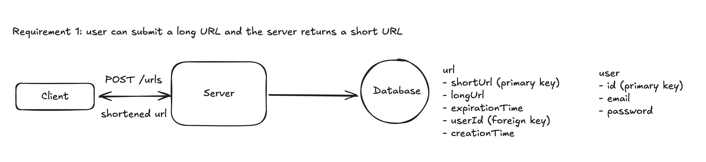
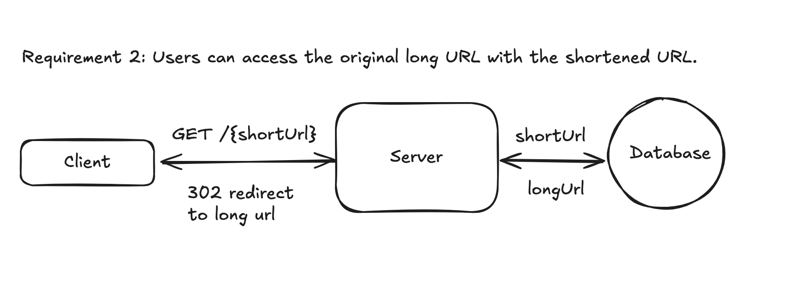

# System Design: A File Storage Service like Google Drive
[Here's some guidelines to approach a system design question.](2025-05-03-system-design-how-to-approach.md)

Let's go through the design process step by step.

## 1. Understand the problem
A file storage service like Google Drive, is something where you can upload, and download files, as well as check version history of a file. 

## 2. Define functional and non-functional requirements 
For functional requirements, the core requirements could be:
- Users should be able to upload a file from any device.
- Users should be able to download a file from any device.
- Users should be able to have their files automatically synced across devices.
- Users should be able to share their files with anyone and view the files shared with them.
- [TODO] Users can check version history of a file.
- [TODO] Users can go back to any version of a file.

For non-functional requirements, the core requirements could be:
- The system should support a maximum file size of 50 GB.
- The system should be highly available (we don't need strong consistency)
- The system should have low latency, i.e. uploads, downloads, file syncs.
- The system should be secure and reliable: files could be recovered if they are lost or corrupted.

We have two ways to upload a file: either we treat a file as whole object and upload it every time whenever it is changed, or we break a file into chunks. We'll choose the latter one here because it'll make uploading more efficient: we'll be able to upload file chunks parallel, and only upload chunks that are changed, instead of the whole file.  

## 2. Identify and define core entities
We identify the following entities in the system:
- User
- Device
- Chunk
- Metadata

`User` represents users in the system.

`Chunk` represents one file chunk, including information like chunk order, version, storage location. To combine chunks back into a file later, we'll use chunk number and version. 

`Metadata` represents file metadata, e.g. file name, mime type, owner, chunk ids.

`Device` represents a device, e.g. laptop, mobile phone


## 3. Design APIs or interfaces
APIs or Interfaces define a communication contract between a client and a server. In this step, we need to go through core functional requirements one by one and define APIs needed to satisfy them.
We'll use RESTful APIs here.

To upload a file, we need an endpoint to accept a file and file metadata. It'll be a POST endpoint as we are creating a new resource, a new file, in the database.

```
// upload a file
POST /files
{
  "file": File,
  "fileMetadata": FileMetadata
}
```

To download a file, we need an endpoint to accept a file id and return its content. It'll be a GET endpoint as we are reading existing records from the database.
```
// retrieve a file
GET /files/{id}

-> response:
{
  "file": File,
  "fileMetadata": FileMetadata
}
```

To sync files across all devices, we need an endpoint for client to query changes to files on the remote server. In that way, client can know which files need to be synced to the local device.
```
// get file changes
GET /files/{fileId}/changes

-> response:
{
    "metadata": a list of metadata
}

```

To share a file with others, we need an endpoint to accept a file id, as well as a list of users to share. It could be something like this:
```
// share a file
POST /files/{fileId}/share/
{
    "users": list of user id
}
```

## 4. Create a high level design
In this step, our task is to come up with a high level design that satisfy all functional requirements.

To get started, we need the following components in the system:

- Client: it sends out users' request to the server.
- Block Server: it splits a file into chunks and upload them file storage.
- File Storage: it's the place where all file chunks are stored. It could be cloud storage, or distributed file system like Apache HDFS.
- API Server: it handles everything other than uploading, e.g. updating metadata, user authentication, sharing files with someone, downloading a file???, 
- Database: it stores information like user profiles and metadata.

Let's think about how components interact with one another to fulfill the functional requirements.

### Functional requirement 1: Users should be able to upload a file from any device.
Client calls POST /urls API, includes URL and other optional parameters like expiration time.
Server receives the request, generates a short URL and stores it into the database.
There should be at least two tables in the database: `User` and `Url`. 
  - `User` has primary key `id`, and other attributes like `email`, `password`, etc. 
  - `Url` has `longUrl`, `shortUrl`, `userId`, `expirationTime`, `creationTime`, etc. `userId` is the foreign key to `User` so that we know to whom a url belongs. `shortUrl` could be the primary key of `url`.




### Functional requirement 2: Users should be able to download a file from any device.
Client calls GET /{shortUrl}.
Server receives the request, look up the database using shortUrl. If it doesn't find the mapping URL or the URL has expired, it returns a 404. If it finds the mapping long URL, it returns 302 redirect with the long URL.
There are two types of redirect: 301 permanent redirect and 302 temporary redirect. 301 could reduce traffic to the server but may not a good choice here because shortened URL could have an expiration time and we don't want the client to redirect to the same long URL forever. In additional, if we want to integrate with analytics tool, we'll need the link clicks to hit our server everytime, in order to get URL click counts.



### Functional requirement 3: Users should be able to have their files automatically synced across devices.
??????

### Functional requirement 4: Users should be able to share their files with anyone and view the files shared with them.
????


## 5. Deep dive to the design
At this point, we have a high level design of the system that satisfies our functional requirements. In this step, we can dive deeper into the design: to have a closer look into server and to consider how to (modify it) fulfill all the non-functional requirements we have.

### Non-functional requirement 1: ensure uniqueness on short URLs
Let's assume we want our URL to be 8-character long.
To convert a long url to short url while maintaining uniqueness, one intuitive way is to use hash function. 

#### Random number generator + base42 encoding
Specifically, we could consider using a random number generator, encode the random number in base62 (using 0-9, a-z, A-Z), and then take the first 8 characters. In this way, the total number of unique combination is 62^8.
That's uniqueness achieved. However, we also need to consider short url collision probability. It's called Birthday problem. It turns out with 10 million URLs, the collision probability is about 4.6%.
In order to avoid collision, we could check if an identical short url already exists in the database before inserting. We could add a hash index on short url code to make O(1) time complexity of query. But this still adds some complexity on the code.

#### Unique number counter + base62 encoding
A better way is to avoid collision by using a unique counter with base62 encoding. 
Redis is a good choice to manage this situation because it is single threaded, which means there won't be race condition. We could use `INCR`. It's an atomic operation which means the increment operation is guaranteed to execute completely without interference from other operations.
If we have 1 billion URLs, and we use base62 encoding, we'll have 6-character because 1,000,000,000 in base62 is '15ftgG'. We only move to 7-character string only when we reach 62^7 (over 3.5 trillion) URLs. 

While unique counter with based62 solve collision problem, it comes with its own challenge. In a distributed system, where there are multiple nodes, how do we ensure the unique number counter is accessible to all nodes and every node agree on the next value? 


### Non-functional requirement 2: the system should have low latency on redirection
The latency between clicking a short url and landing on the original long url should be less than 200 ms. This should be enough for human feel of "real-time".

#### Indexing
There are a few things to consider. 
First of all, the database. Server needs to query long url by short url, we need to ensure a low latency in queries. We could achieve this by adding proper indexes. For instance, if a common use case is querying long url by using short url, user id and expiration time. Add a composite index on these three fields would make query faster.
In terms of index types, there are a few options:
- B-tree indexing: most rational databases' default index is B-tree which provides O(log n) look up time. It would be sufficient for large tables. 
- Primary key: we have made the short url as the primary key, which ensure both uniqueness and indexing.
- Hash indexing: for databases like Postgres, we could add hash index on short url. In that way, we could have O(1) retrieval time.

However, indexing itself is not enough to support a large scale system. For instance, let say we have 100M daily active users, and each one of them get 5 redirects a day, and we assume that traffic is distributed evenly. It means the system needs to handle
```
10^9 DAU * 5 redirects = 50^9 redirects perday
50^9 redirects / 24 hours * 3600 seconds = ~5,787 redirects per second 
```
It'd be challenging for most relational databases. 

#### In-memory caching
To reduce the pressure on the database, we could consider adding in-memory cache like Redis. Instead of routing to the database for every redirect, the server first checks if data exists in Redis. If yes, fetch the data and return to client. Only query database if no data exists in Redis and update Redis after data is queried from the database.
Even though in-memory cache can greatly improve performance, there are some challenges as well. Firstly, in-memory cache needs time to warm up, which means initial requests goes to the database before cache is populated. Secondly, cache invalidation can be complex: in case of updates and deletes we need to update cache properly. Thirdly, we need to decide memory allocation, cache size, eviction policy, as well as which entries to store in in-memory cache. 


#### Content Delivery Network (CDN)
Another way to improve performance is to utilize CDN and edge computing. Specifically, the short url domain is served through a CDN with Points of Presence (PoPs) geographically, the CDN nodes cache the mappings of short and long urls, and redirects can be handled by a node closest to the location of the user. What's more, we could deploy the redirect logic to the edge like AWS Lambda@Edge, so requests will be handled at the edge and won't even need to reach to the server.
The tradeoff here is higher cost and more complex CDN and edge computing setup.

### Non-functional requirement 3: the system should scale to support 1 billion shortened URLs and 100 million DAU.

[//]: # (We can imagine that system like this would expect more read requests than write requests. Let's assume that the ratio of read to write is 1 to 5.)
[//]: # (We did some math in previous section: for 100M DAU, there'll be around 6k redirects per second on average. )
[//]: # (If we consider peak hours the traffic will increase by 5 times, there'll be a total of 30k requests per second during peak hours.)

Let's take a look at our service first. In order to increase servers during peak hours and reduce servers when traffic drops, we could deploy our server in EC2 Auto Scaling group. 
With proper configuration of `desired instance`, `max instance` and `min instance`, as well as scaling policies, AWS automatically provision and de-provision servers for us.
In additional, we add a Elastic Load Balancer to distribute traffic to each server within the auto-scaling group.

As for our unique counter, we need to make it the single source of true because there could be multiple nodes, and we need to ensure the uniqueness among the nodes.
For instance, we can have a centralized Redis instance as the global unique counter, and enable Redis replication for availability. 

Now let's shift our focus to the database.

First of all, let's do a bit of math to decide if a single database instance is enough to store 1B short urls. As defined in high level design, each row in data our database consists of the following:
- short url code, ~8 bytes
- long url, ~100 bytes
- expiration time, ~8 bytes 
- userId, ~4 bytes
- other fields, e.g. creation time, created by, ~ 150 bytes

That means each row is about 270 bytes, rounded up to 300 bytes. So for 1B rows, the total is 300 bytes * 1B rows = 300GB of data.
This fits within modern SSDs and thus for now, a single instance of rational database, like MySQL and Postgres, is enough. If we have more data in the future and high hardware limit, we could do sharding and store the data across different servers.


However, if we only have one database instance, we need to consider availability: what if the only database goes down? In that case the whole server will be unavailable. To prevent this, we can do one of the following:
- database replication
- database backup

Database replication is by default supported in many rational database, like [MySQL](https://dev.mysql.com/doc/refman/8.4/en/replication.html), Postgres. Data from source database server is copied into one to more database servers (replicas). When source database server is down, traffic is redirected to one of the replicas.
This, on the other hand, adds addition optional overhead because we need to ensure the connection between source and replicas works.

Another way to have database backup by taking database snapshots periodically and stored them in a different place. In terms of recovery time: it takes time to restore from a backup, depending on the size and complexity of the database.
This, of course comes with additional optional effort since we need to make sure the backup process works.

## Final Design


