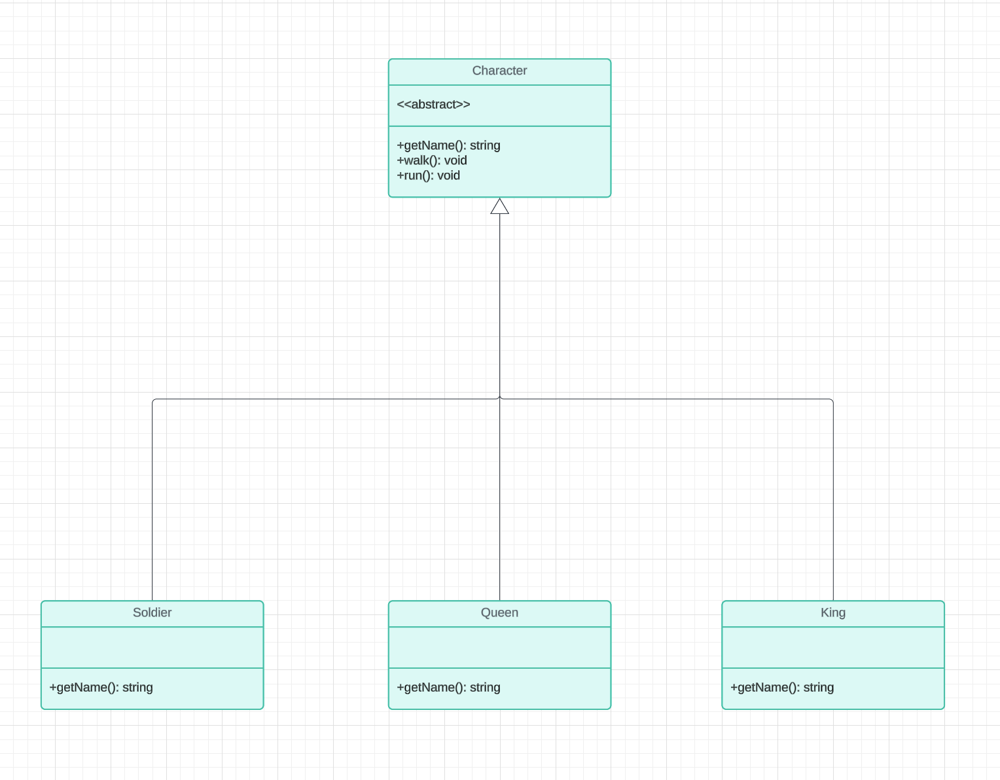

# A Review of Design Patterns
[TODO] description. what this is about.
Overview of all 23 design patterns and category

## Strategy Pattern
### Definition  
Strategy is a behavioral pattern that encapsulates a family of algorithms and enables selecting a specific algorithm at runtime.
Strategy lets the algorithm vary independently of clients that use it.
It's useful when you want the application to do X, but X is not clear yet and would change in the near future.

### Example
Let's say we are building a video game. When defining characters' movement, we want them to run or walk. How to implement it? One way is through inheritance:

Our implementation may look something like this: 
```Java
public abstract class Character {

    public abstract String getName();

    public void walk() {
        System.out.println("walking..");
    }

    public void run() {
        System.out.println("running!");
    }

}

public class Queen extends Character {

    @Override
    public String getName() {
        return "Elegant Queen";
    }

}

public class King extends Character {

    @Override
    public String getName() {
        return "Ugly King";
    }
}

```
So far, everything works. However, what if we want to add new characters in the future, and they have fancier way to move? For example, 
- Dr.Who, who teleports
- Mermaid, who swims
- Rabbit, who burrows underground.

How to implement these requirements? With the current implementation, we'll need to add `swim()`, `teleport()` and `burrowUnderground()` in the parent class `Character`. 
```java
public abstract class Character {

    public abstract String getName();

    public void walk() {
        System.out.println("Walking..");
    }

    public void run() {
        System.out.println("Running!");
    }

    public void teleport() {
        System.out.println("Fancy teleport!");
    }

    public void swim() {
        System.out.println("Swimming.");
    }

    public void burrowUnderground() {
        System.out.println("Burrowing underground - you can't see me!");
    }
}
```
However, by doing that we give King, Queen and Soldier all these new capabilities that they shouldn't have!
```java
public class CharacterSimulator {

    public static void main(String[] args) {
        Character queen = new Queen();
        System.out.println(queen.getName());
        queen.walk();
        queen.run();
        queen.burrowUnderground();
        queen.teleport();
    }
}
```
Output:
```
Elegant Queen
Walking..
Running!
Burrowing underground - you can't see me!  // not what we want Queen to do
Fancy teleport!                            // not what we want Queen to do
```


We could override these new methods in `Queen`, `King` and `Soldier` and return early. However, we need to keep doing this whenever we add new characters and new movement in the future. That's no convenience.
```java
public class Queen extends Character {

    @Override
    public String getName() {
        return "Elegant Queen";
    }

    @Override
    public void burrowUnderground() {
        System.out.println("Queen doesn't burrow underground!");
    }

}
```
To make our lives easier, we need to find a way to change movement without changing our existing characters - that's when Strategy pattern comes in handy. 
`Character` has two types of method, one is common for all characters and won't change, like `getName()`; the other is changeable like movements.
We can encapsulate movements in an interface and let each character uses a different movement at runtime.

Following is the new class diagram using Strategy pattern. 


We need to do the following in our code:
1. Create an interface called `MovementBehavior`.
2. Create different types of movement that implement the interface, i.e. `Teleport`, `BurrowUnderground`, `Swim`.
3. Extract `walk()` and `run()` from `Character` and make them implementations of `MovementBehavior`, i.e. `Run`, `Walk`. 
4. Use specific movement in specific character.

```java
// Character related 
public abstract class Character {

    MovementBehavior movementBehavior;

    public abstract String getName();

    public void move() {
        movementBehavior.move();
    }

}

public class DrWho extends Character {

    @Override
    public String getName() {
        return "Cool Dr.Who";
    }

    public DrWho() {
        movementBehavior = new Teleport();
    }

}

public class Queen extends Character {

    @Override
    public String getName() {
        return "Elegant Queen";
    }

    public Queen() {
        movementBehavior = new Walk();
    }
}
// ... similar changes to `King` and `Soldier`

// Movement related
public interface MovementBehavior {
    void move();
}

public class Teleport implements MovementBehavior {

    @Override
    public void move() {
        System.out.println("Check this out - I'm teleporting!");
    }
}

public class BurrowUnderground implements MovementBehavior {

    @Override
    public void move() {
        System.out.println("Burrowing underground - you can't see me!");
    }
}

public class Walk implements MovementBehavior {

    @Override
    public void move() {
        System.out.println("Walking..");
    }
}
// ... similar changes to `Swim` and `Run`
```
Now, let's test our code:
```java
public class CharacterSimulator {

    public static void main(String[] args) {
        Character drWho = new DrWho();
        drWho.move();

        Character queen = new Queen();
        queen.move();
    }
}
```
```
// output:
Check this out - I'm teleporting!
Walking..
```
So far, we isolate movement from `Character` so that whenever there are new types of movement added, we don't need to change existing characters.
    But what if we want characters to have new moves? To do that, we can simply add a setter `setMovementBehavior(MovementBehavior mb)` in `Character`:
```java
public abstract class Character {

    MovementBehavior movementBehavior;

    public abstract String getName();

    public void move() {
        movementBehavior.move();
    }

    public void setMovementBehavior(MovementBehavior mb) {
        this.movementBehavior = mb;
    }

}
```
Test and see if Dr.Who can move differently now:
```java
public class CharacterSimulator {

    public static void main(String[] args) {
        Character drWho = new DrWho();
        drWho.move();

        drWho.setMovementBehavior(new BurrowUnderground());
        drWho.move();
    }
}
```

```
// Output
Check this out - I'm teleporting!
Burrowing underground - you can't see me!
```
Well, yes, he can!

### Summary
From the above example, we can see it's important to **identify areas in your application that may need to change and isolate them from other areas that do not change**. 
In cases where properties or methods are prone to change or unclear during development, we should **use composition more, inheritance less**. And as always, **programing to the interface, not the implementation** would make our code more flexible.

## Reference
- Head First Design Patterns, by Eric Freeman, Elisabeth Robson, Bert Bates, Kathy Sierra

- https://stackoverflow.com/questions/370258/real-world-example-of-the-strategy-pattern
